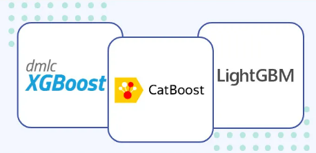
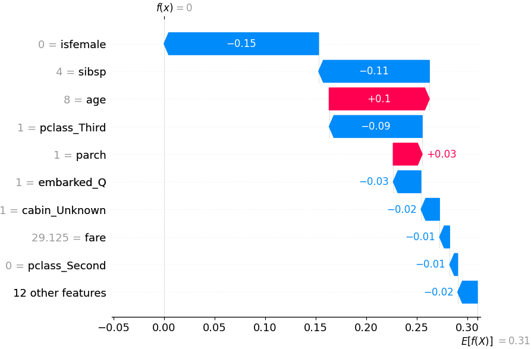

# Catboost
Main advantages of CatBoost:
--------------
Implementing Catboost for titanic dataset.

The motivation for using Catboost was Sits superior quality when [compared](https://github.com/catboost/benchmarks/blob/master/README.md) with other gradient boosting methods for many benchmark datasets.

The code also provides some basic steps for data preprocessing.

The repo also provides charts for SHapely Additive exPlanations (SHAP) values.

## Future Work

- [ ] Add pipeline to check the impact of data preprocessing
- [ ] Add other models for benchmarking

## References 
--------------
https://catboost.ai/docs/concepts/about.html
https://shap.readthedocs.io/en/latest/ 

